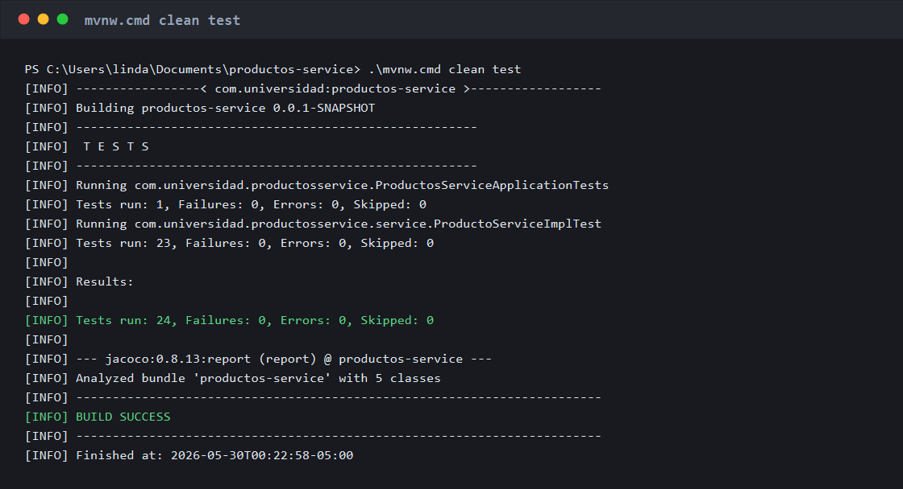

# productos-service

Microservicio Spring Boot para gestionar productos y practicar pruebas unitarias,
validacion arquitectonica con ArchUnit y documentacion de decisiones con ADR.

## Tecnologias

- Java 21
- Spring Boot 3.5.14
- Spring Web
- Spring Data JPA
- H2 Database
- Lombok
- JUnit 5, Mockito, JaCoCo y ArchUnit
- GitHub Actions

## Estructura principal

```text
src/
|-- main/java/com/universidad/productosservice/
|   |-- ProductosServiceApplication.java
|   |-- controller/ProductoController.java
|   |-- domain/Producto.java
|   |-- repository/ProductoRepository.java
|   `-- service/
|       |-- ProductoService.java
|       `-- ProductoServiceImpl.java
`-- test/java/com/universidad/productosservice/
    |-- ProductosServiceApplicationTests.java
    |-- ReglasArquitectura.java
    `-- service/ProductoServiceImplTest.java
```

## Ejecucion

Compilar el proyecto:

```bash
./mvnw compile
```

Ejecutar pruebas unitarias, reglas de arquitectura y generar el reporte JaCoCo:

```bash
./mvnw test
```

Ejecutar solo las reglas de arquitectura:

```bash
./mvnw test -Dtest=ReglasArquitectura
```

Iniciar la aplicacion:

```bash
./mvnw spring-boot:run
```

## Endpoints

| Metodo | Ruta | Descripcion |
| --- | --- | --- |
| POST | `/api/productos` | Crea un producto |
| GET | `/api/productos/{id}` | Busca un producto por id |
| PATCH | `/api/productos/{id}/stock` | Actualiza el stock |
| DELETE | `/api/productos/{id}` | Elimina un producto |

Ejemplo para crear:

```json
{
  "nombre": "Laptop",
  "precio": 1500.0,
  "stock": 10
}
```

## Pruebas

La suite `ProductoServiceImplTest` cubre:

- Creacion exitosa de productos.
- Busqueda por id existente y no existente.
- Validaciones de nombre, precio y stock con pruebas parametrizadas.
- Normalizacion del nombre con `ArgumentCaptor`.
- Actualizacion de stock.
- Eliminacion de producto existente.

El reporte JaCoCo se genera en `target/site/jacoco/index.html`.



## Validacion Arquitectonica

La clase `ReglasArquitectura` usa ArchUnit para ejecutar cinco reglas sobre
`com.universidad.productosservice`:

1. `dominioNoDependeDeCapasAplicacion`: el paquete `domain` no depende de `controller`, `service` ni `repository`.
2. `controladoresNoAccedenRepositorios`: los controladores no acceden directamente a repositorios.
3. `controladoresSoloAccedenCapasPermitidas`: los controladores solo acceden a `controller`, `service`, `domain`, Spring y Java.
4. `contratosDeServicioSonInterfaces`: los contratos de servicio que terminan en `Service` son interfaces.
5. `repositoriosSonInterfacesJpa`: los repositorios son interfaces basadas en `JpaRepository`.

El workflow `.github/workflows/arquitectura.yml` ejecuta estas reglas en cada
push a `main` o `develop`, y tambien en pull requests hacia `main`. Despues de
las reglas de arquitectura ejecuta la suite completa con `./mvnw verify`.

## Decisiones de Arquitectura

Los ADRs estan en `docs/adr/`:

- `ADR-001.md`: arquitectura por capas para el microservicio de productos.
- `ADR-002.md`: Spring Data JPA con H2 para persistencia local.
- `ADR-003.md`: validaciones de negocio en la capa de servicio.
